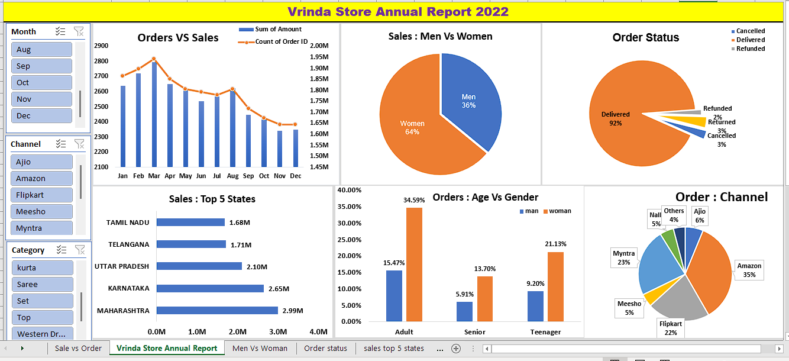

#  Vrinda Store Data Analysis using Microsoft Excel

##  Project Overview

This project analyzes the annual sales performance of Vrinda Store using Microsoft Excel. The objective is to transform raw sales data into meaningful business insights through data cleaning, pivot tables, charts, and an interactive dashboard.

The dashboard helps identify sales trends, customer behavior, order status, top-performing states, and sales channels to support business decision-making.

---

##  Project Objectives

- Analyze annual sales performance
- Compare sales by gender
- Analyze customer age groups
- Identify top-performing states
- Analyze order status
- Compare sales channels
- Build an interactive Excel dashboard
- Generate business insights for decision-making

---

##  Dataset Information

The dataset contains information related to:

- Customer Orders
- Sales Amount
- Gender
- Age Group
- State
- Sales Channel
- Order Status
- Monthly Sales

---

##  Tools Used

- Microsoft Excel
- Pivot Tables
- Pivot Charts
- Slicers
- Conditional Formatting
- Excel Functions
- Interactive Dashboard

---

##  Dashboard Features

The dashboard includes the following analysis:

- Monthly Sales vs Orders
- Sales by Gender
- Sales by Age Group
- Sales by State
- Sales by Sales Channel
- Order Status Analysis
- Top 5 States by Sales
- Interactive Filters (Slicers)

---

##  Key Performance Indicators (KPIs)

- Total Sales
- Total Orders
- Monthly Sales Trend
- Sales by Gender
- Sales by Age Group
- Sales by State
- Sales by Channel
- Order Status Distribution

---

##  Key Business Insights

- Women customers contributed more sales compared to men.
- Adult customers generated the highest number of orders.
- Maharashtra was one of the top-performing states.
- Amazon was among the leading sales channels.
- Most customer orders were successfully delivered.
- Sales performance varied across different months.

---


##  Data Cleaning Process

The following data preparation steps were performed:

- Checked missing values
- Removed duplicate records
- Standardized data format
- Created Age Groups
- Verified Order Status
- Prepared data for Pivot Tables

---


#  Dashboard Preview

> Upload your dashboard screenshot as **Dashboard.png** and replace the image below.

```markdown

```

---


## Project Structure

```
Vrinda-Store-Data-Analysis/

├── README.md
├── Vrinda Store Data Analysis.xlsx
├── Dashboard.png


##  Skills Demonstrated

- Data Cleaning
- Data Analysis
- Dashboard Design
- Pivot Tables
- Pivot Charts
- Data Visualization
- Business Analysis
- KPI Reporting
- Microsoft Excel

---

> **Note:**-- This Excel workbook includes the complete workflow, including raw data, data cleaning, Pivot Tables, Pivot                    Charts, and the final interactive dashboard in a single file.


##  Conclusion

This project demonstrates the use of Microsoft Excel to convert raw sales data into meaningful business insights through interactive dashboards and data visualization techniques. It highlights practical analytical skills that support business decision-making.


